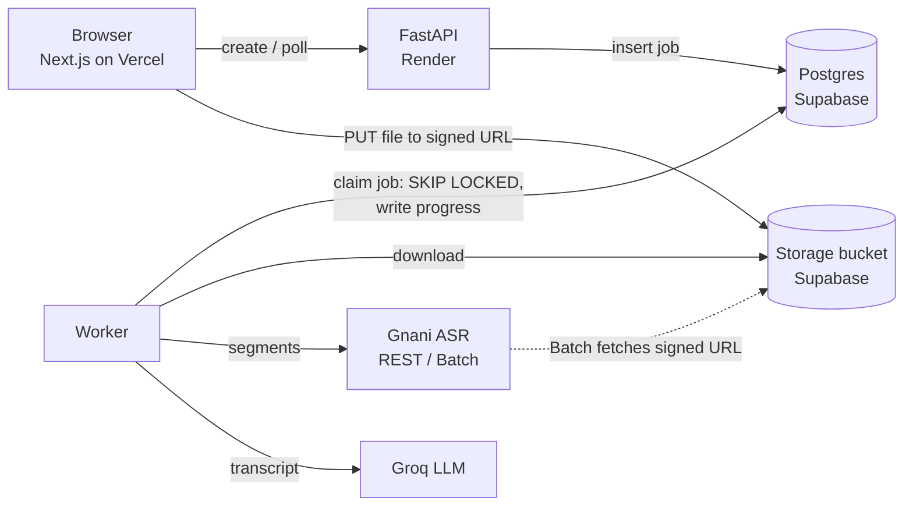

# Audio Notes

Upload an audio file of any length. Get back a transcript from **Gnani ASR** and a summary written by an **LLM**. Past uploads are listed and can be reopened.

**Live app:** https://audio-notes-rust.vercel.app
**Architecture write-up:** https://audio-notes-rust.vercel.app/architecture

> The backend runs on Render's free tier, which sleeps when idle. The first request can take up to a minute; the app shows a "Starting the server" banner while it wakes.

---

## Trying it

1. Open the live app and drop in an audio file (MP3, WAV, M4A, OGG, FLAC and more; up to 50 MB).
2. Pick the spoken language (10 Indian languages are supported) and keep the method on **Automatic**.
3. Click **Upload and transcribe**. You'll see:
   - byte-level upload progress, with speed and time remaining
   - a timeline of the recording split into segments, each filling in as Gnani returns it
   - transcript text appearing segment by segment, before the whole job is finished
   - the summary once the transcript is complete
4. Click any timestamp in the transcript to play the audio from that point.
5. To see failure handling, upload a non-audio file renamed to `.mp3`.

Your history is kept per browser, so a fresh browser or incognito window starts empty.

---

## How the brief maps to the implementation

| Requirement | How it's met |
|---|---|
| Upload audio of any length or size | Browser uploads **directly to a private storage bucket** via a signed URL, so large files never pass through the API server. |
| Transcribe with Gnani ASR | Audio is split at natural pauses into ~25 s segments for Gnani's REST endpoint (60 s limit), transcribed in parallel. Gnani's **Batch API** is a second engine and an automatic fallback. |
| Display the transcript | Timed view (click to seek) and plain view, with copy and `.txt` download. |
| LLM summary | Groq (Llama 3.3 70B, falling back to another Groq model automatically). Long transcripts are summarised map-reduce style. |
| Past uploads listed and reopenable | History list with live status; each recording has its own page. |
| Next.js, FastAPI, Postgres, bucket, background jobs | Next.js on Vercel · FastAPI on Render (Docker, ffmpeg) · Postgres and Storage on Supabase · a Postgres-backed job queue. |
| Deployed, usable without setup | Live link above. |
| `/architecture` page with GitHub link | In the app, linked from the top navigation. |
| Visible failure handling | Every failure states what happened and whether retrying helps (see below). |
| Progress for long files | Stage tracker, percentage, per-segment timeline and an activity log, updated every 1.5 s. |

---

## Architecture in brief



**Flow:** the API creates a recording and returns a signed upload URL → the browser uploads straight to the bucket → the API confirms the object exists and enqueues a job → a worker decodes and validates the audio, transcribes it, summarises it, and writes progress to Postgres at every step → the page polls and renders it.

**Synchronous vs background:** every API endpoint returns in milliseconds (create, confirm upload, list, read, retry, delete). Everything slow runs in the worker: decoding, pause detection, all Gnani calls, Batch polling, and the summary.

**Background jobs:** the queue is a Postgres table. Workers claim jobs with `SELECT … FOR UPDATE SKIP LOCKED`, refresh a heartbeat every 10 s, and a job whose heartbeat goes stale (crashed worker, restarted host) is reclaimed automatically. Retryable failures back off (20 s, 40 s) for up to three attempts.

The full explanation, including what I would do differently with more time, is on the [`/architecture`](https://audio-notes-rust.vercel.app/architecture) page.

---

## Handling long audio

Gnani's REST endpoint accepts at most 60 seconds per request (30 s recommended), so a two-minute file already has to be split.

- **Split at pauses, not at fixed times.** The worker decodes to 16 kHz mono WAV, finds pauses with ffmpeg `silencedetect`, and cuts each ~25 s segment at the pause nearest the target within a 12–29 s window. It only makes a hard cut if a window contains no pause, which avoids slicing words in half.
- **Parallel, with retries.** Four segments are in flight at once. Each retries timeouts, 429s and 5xx errors with exponential backoff and jitter, honouring `Retry-After`. A 401 or 403 (bad key, no credits) stops immediately.
- **Resumable.** Each segment's text is saved the moment it returns. Retries and worker crashes skip finished segments, so neither time nor ASR credits are spent twice.
- **Two engines.** In *Automatic* mode, if segments keep failing, the worker switches to Gnani's Batch API, which reads the file from a signed bucket URL. *Batch* mode reverses the order. The Batch job id is stored, so a restarted worker resumes polling instead of submitting and paying for a duplicate job.
- **Long transcripts for the LLM.** Transcripts over ~24k characters are condensed section by section, then summarised from the section notes.

---

## Failure handling

| What goes wrong | What the user sees |
|---|---|
| Wrong file type, empty, or over 50 MB | Rejected in the browser before uploading (and again by the API). |
| Upload drops, is cancelled, or storage rejects it | Error with a **Try again** button; the failed upload is still listed in history. |
| Corrupt or non-audio file | "This file can't be transcribed", with the reason. Truncated files are transcribed as far as they decode, with a warning. |
| Gnani timeouts, 429s or 5xx errors | Retried per segment; if they persist, an amber **Retrying** state with the exact error and countdown. Finished segments are kept. |
| Gnani key invalid or out of credit | Fails at once with an explanation, since retrying cannot help. |
| Individual segments cannot be transcribed | Marked in place in the transcript with their time range, never silently dropped. |
| LLM unavailable or model retired | Falls back to the next model; if all fail, the transcript is still shown with a **Retry summary** button. |
| Worker or server dies mid-job | Job is reclaimed via its stale heartbeat and resumes from the last finished segment. |
| Server asleep (free tier) | "Starting the server" banner instead of a frozen page. |

Every recording also has an **activity log** listing what the system did and when.

---

## Tech stack

| Layer | Choice |
|---|---|
| Frontend | Next.js 16 (App Router, TypeScript), proxies `/api/*` to the backend so there is no CORS |
| Backend | FastAPI, SQLAlchemy 2, psycopg 3, httpx |
| Audio | ffmpeg / ffprobe (decoding, validation, pause detection) |
| Database | Postgres (Supabase) |
| Storage | Supabase Storage, private bucket, signed URLs |
| Speech to text | Gnani Prisma v2.5: REST `/stt/v3` and Batch `/stt/v3/batch/jobs` |
| Summary | Groq: `llama-3.3-70b-versatile`, with `openai/gpt-oss-120b` as fallback |
| Hosting | Vercel (frontend), Render (backend, Docker) |

---

## Repository layout

```
backend/
  app/
    main.py         HTTP API (every endpoint returns in milliseconds)
    worker.py       Postgres job queue: claim, heartbeat, backoff retry, reclaim
    pipeline.py     validate -> chunk -> transcribe (REST or Batch, with fallback) -> summarise
    audio.py        ffprobe/ffmpeg decoding, pause detection, chunk planning
    gnani.py        Gnani REST + Batch clients, errors classified as transient or permanent
    summarize.py    Groq client, model fallback, map-reduce for long transcripts
    storage.py      Supabase Storage (production) and local disk (development), signed URLs
    db.py           Tables: recordings, chunks, jobs, events
  tests/
    test_chunking.py    unit tests for the chunk planner
    mock_providers.py   fake Gnani, Groq and Supabase Storage with switchable failures
    e2e.py              drives the API exactly as the browser does
  Dockerfile
frontend/
  app/page.tsx                    upload and history
  app/recordings/[id]/page.tsx    progress, transcript, summary, activity log
  app/architecture/page.tsx       the architecture write-up
  components/                     upload panel, progress timeline, status badges
render.yaml                       Render blueprint for the backend
```

---

## Testing

A mock server (`backend/tests/mock_providers.py`) imitates Gnani REST and Batch, Groq, and Supabase Storage, and can be told to fail in specific ways. These scenarios were run end to end against it, including in a real browser:

- 3.5-minute MP3, uploaded through the UI to completed transcript and summary
- 40% ASR error rate: absorbed by per-segment retries
- ASR completely down: automatic fallback to the Batch API
- Batch job fails: fallback to chunked REST
- Gujarati requested in Batch mode: routed to REST, which supports it
- Corrupt and non-audio files; unsupported extensions
- LLM model decommissioned: next model used; LLM down: transcript kept, summary retried manually
- Manual retry after an outage: finished segments reused
- Server killed mid-job: job reclaimed and resumed from where it stopped
- Recordings invisible to other browsers

The live deployment has also been tested with the real Gnani and Groq APIs.

```bash
cd backend
pip install -r requirements.txt pytest
python -m pytest tests/test_chunking.py

# Full pipeline against the mocks (needs a local Postgres and ffmpeg)
uvicorn tests.mock_providers:app --port 9100 &
set -a; . ./.env.mock; set +a
uvicorn app.main:app --port 8000 &
python tests/e2e.py path/to/audio.mp3
curl -XPOST localhost:9100/_control -d '{"rest_fail_rate":1.0}'   # then rerun: falls back to Batch
```

---

## Known limitations

- **No accounts.** History is scoped by a random id stored in the browser. This keeps reviewers' uploads apart without sign-up, but it is not authentication.
- **50 MB upload cap.** This is Supabase's free-tier object limit, roughly 50 minutes of typical MP3. The pipeline itself handles recordings up to 3 hours.
- **Polling, not push.** The page polls every 1.5 s; server-sent events would be more efficient.
- **Single-request uploads.** A dropped connection restarts the upload; resumable (TUS) uploads would fix this.
- **Cold starts.** Free-tier hosting sleeps when idle.

---

## Running locally

```bash
# Postgres
docker run -d -p 5432:5432 -e POSTGRES_PASSWORD=postgres -e POSTGRES_DB=audionotes postgres:16

# Backend (needs ffmpeg on PATH)
cd backend
python -m venv .venv && . .venv/bin/activate
pip install -r requirements.txt
cp .env.example .env     # fill in keys; STORAGE_BACKEND=local works without Supabase
uvicorn app.main:app --reload --port 8000

# Frontend
cd frontend
npm install
BACKEND_URL=http://localhost:8000 npm run dev
```

With `STORAGE_BACKEND=local`, files stay on disk and the Batch API is unavailable (Gnani has to fetch audio from a public URL), so Automatic mode uses chunked REST only.

<details>
<summary><strong>Deploying your own copy</strong></summary>

You need free accounts on Supabase, Render, Vercel, Gnani and Groq.

**Supabase**
1. Create a project (Mumbai region is closest to Gnani).
2. Storage → New bucket → name `recordings`, private, 50 MB file limit.
3. Click **Connect** → copy the **Session pooler** string → change `postgresql://` to `postgresql+psycopg://` and insert your password. This is `DATABASE_URL`.
4. Project Settings → API Keys → **Legacy API Keys** → copy `service_role`. This is `SUPABASE_SERVICE_KEY`. Your project URL `https://<ref>.supabase.co` is `SUPABASE_URL`.

Tables are created automatically on first start.

**Render (backend)**
1. New → Blueprint → select this repo (it reads `render.yaml`).
2. Set `DATABASE_URL`, `SUPABASE_URL`, `SUPABASE_SERVICE_KEY`, `GNANI_API_KEY`, `GROQ_API_KEY`.
3. After deploy, `https://<service>.onrender.com/api/health` should return `{"ok":true}`.

**Vercel (frontend)**
1. Import the repo, set **Root Directory** to `frontend`.
2. Set `BACKEND_URL` (the Render URL) and `NEXT_PUBLIC_GITHUB_URL` (this repo).
3. Deploy.

**Configuration** (see `backend/.env.example`)

| Variable | Default | Purpose |
|---|---|---|
| `MAX_UPLOAD_MB` | 50 | Upload size cap |
| `MAX_DURATION_MIN` | 180 | Duration cap, protects ASR credits |
| `CHUNK_TARGET_S` / `CHUNK_MAX_S` | 25 / 29 | Segment length for the REST path |
| `CHUNK_CONCURRENCY` | 4 | Parallel Gnani requests per recording |
| `GROQ_MODELS` | `llama-3.3-70b-versatile,openai/gpt-oss-120b,llama-3.1-8b-instant` | Tried in order |
| `RUN_WORKER_IN_PROCESS` | true | Worker runs inside the API process; set false and run `python -m app.worker` separately |

</details>
